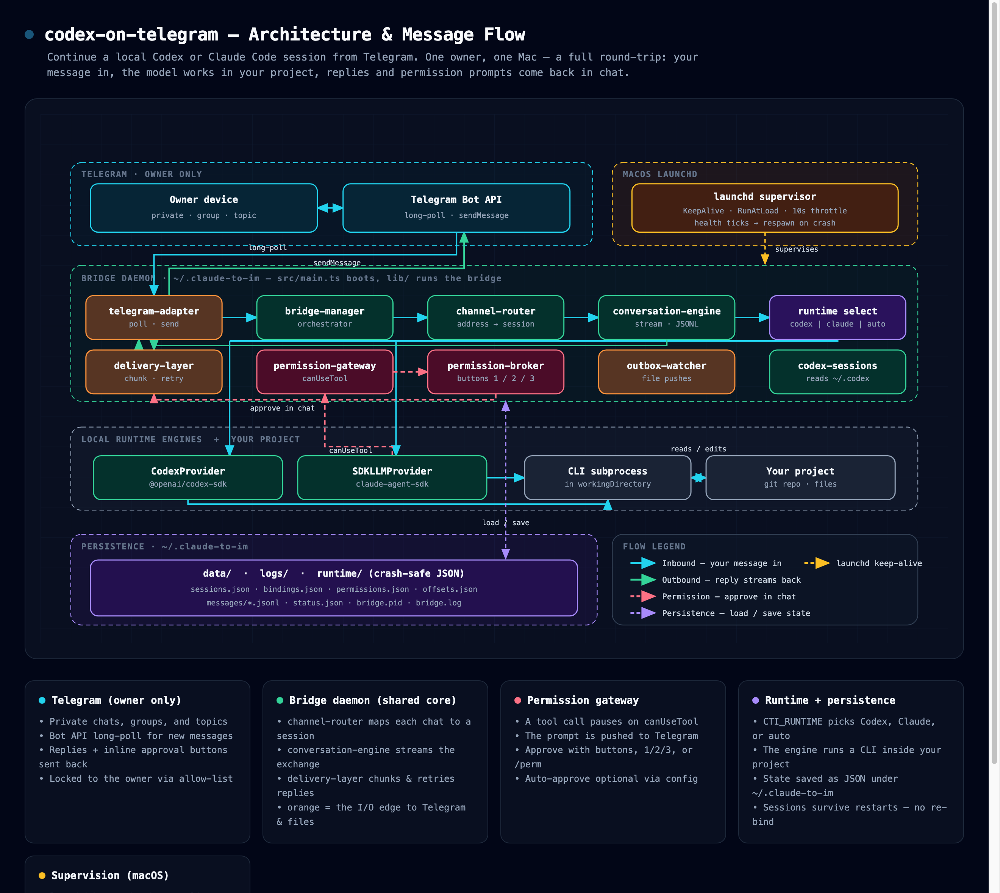

<div align="center">

# Codex on Telegram

**Drive your local Claude Code & OpenAI Codex coding sessions — straight from Telegram.**

[](./LICENSE)
[](https://nodejs.org/)


**English** · [简体中文](./README.zh-CN.md) · [日本語](./README.ja.md)

</div>

---

Codex on Telegram is a self-hosted bridge that lets you **start, bind, and continue local AI coding sessions — Claude Code or OpenAI Codex — from a Telegram chat**. Kick off work from your phone, answer permission prompts on the go, and resume the exact same session after a daemon restart. It runs as a small macOS daemon and speaks Telegram only, by design.

<p align="center">
  
</p>

<p align="center"><sub>Telegram ⇄ bridge daemon (this repo) ⇄ Claude Code / OpenAI Codex ⇄ your local project · <a href="./docs/diagrams/architecture.html">interactive HTML</a></sub></p>

## ✨ Highlights

- **Two runtimes, one bridge.** Switch between Claude Code and OpenAI Codex with a single setting (`CTI_RUNTIME` = `claude` | `codex` | `auto`). The Codex SDK is an *optional* dependency, so the bridge still installs and runs without it.
- **Anti-wedge stream watchdogs.** Startup, mid-stream, and terminal idle timers detect a stalled Codex stream and abort it — instead of silently delivering a half-finished answer as "done".
- **Tool-aware & self-healing.** Long-running tool calls won't trip the watchdog; a transient mid-stream timeout retries on a fresh thread; aborting a wedged turn actually kills the underlying subprocess instead of leaking it.
- **Crash-safe persistence.** In-flight task state and outbound message references are written to disk, so a daemon restart resumes the same bound session.
- **Per-topic sessions.** Private chats, groups, and topic-enabled groups each keep their own bound session; owner and allowlist locks keep the bot yours.
- **Operations built in.** One-command daemon control (`start` / `stop` / `status` / `logs`), a `doctor` health check, and a macOS supervisor.

## How it works

Codex on Telegram is a thin host wrapper around a vendored, Telegram-only bridge core:

- **The wrapper** (`src/`) adds the Codex runtime, on-disk persistence, and the reliability layer (watchdogs, retries, abort handling).
- **The bridge core** (`lib/`) — Telegram adapter, session routing, delivery / retry / dedup, permission handling, input validation, rate limiting, and Markdown→Telegram rendering — is op7418's [`claude-to-im`](#credits), vendored unchanged.

## Requirements

- **macOS**
- **Node.js ≥ 20**
- A **Telegram bot token** (from [@BotFather](https://t.me/BotFather))
- At least one runtime: the **Claude Code CLI**, and/or **`@openai/codex-sdk`** for the Codex path

## Quick start

```bash
git clone https://github.com/leoshenzh/codex-on-telegram.git
cd codex-on-telegram
npm install
npm run build
```

Create your config (the data home is `~/.claude-to-im/`):

```bash
mkdir -p ~/.claude-to-im
cp config.env.example ~/.claude-to-im/config.env
```

Edit `~/.claude-to-im/config.env` and set at least:

```bash
CTI_RUNTIME=codex                       # claude | codex | auto
CTI_TG_BOT_TOKEN=123456:your-bot-token  # from @BotFather
CTI_TG_OWNER_USER_ID=100000001          # your Telegram user ID (owner lock)
CTI_TG_ALLOWED_USERS=100000001          # comma-separated allowlist
CTI_DEFAULT_WORKDIR=/path/to/your/project
```

For group / topic use, also set `CTI_TG_REQUIRE_PRIVATE_CHAT=false` and **disable privacy mode** for your bot in @BotFather so normal group messages reach the bridge.

Start the daemon:

```bash
bash scripts/daemon.sh start
```

## Daemon commands

| Command | What it does |
| --- | --- |
| `bash scripts/daemon.sh start` | Start the bridge daemon |
| `bash scripts/daemon.sh stop` | Stop the daemon |
| `bash scripts/daemon.sh status` | Show running status |
| `bash scripts/daemon.sh logs [N]` | Tail the last *N* log lines |
| `bash scripts/doctor.sh` | Run health & config diagnostics |

## Configuration

The full list lives in [`config.env.example`](./config.env.example). The most common fields:

| Variable | Description |
| --- | --- |
| `CTI_RUNTIME` | Backend runtime: `claude` / `codex` / `auto` |
| `CTI_DEFAULT_WORKDIR` | Default working directory for new sessions |
| `CTI_DEFAULT_MODE` | Default mode: `code` / `plan` / `ask` |
| `CTI_DEFAULT_MODEL` | Optional model override (inherits the runtime default if unset) |
| `CTI_TG_BOT_TOKEN` | Telegram bot token |
| `CTI_TG_OWNER_USER_ID` | Owner-only lock (your Telegram user ID) |
| `CTI_TG_ALLOWED_USERS` | Comma-separated allowlist of users / chats |
| `CTI_TG_REQUIRE_PRIVATE_CHAT` | Set `false` to allow groups / topics |
| `CTI_AUTO_APPROVE` | Auto-approve tool permission prompts |
| `CTI_CODEX_*` | Codex runtime overrides (approval policy, sandbox mode, reasoning effort, network access, …) |

## Running both runtimes at once

A single daemon binds to **one** runtime, chosen once at startup — every session on that daemon shares it. To use Codex *and* Claude side by side, run **two daemons**, one per runtime, fully isolated. Each daemon needs:

- its **own clone** of the repo — the macOS launchd service label is derived from the repo's path, so two daemons must live in two different directories;
- its **own data home** via `CTI_HOME` (separate config, sessions, pid, logs);
- its **own bot token** — you'll talk to two different bots.

```bash
# Bot A — Codex
git clone https://github.com/leoshenzh/codex-on-telegram.git cot-codex
cd cot-codex && npm install && npm run build
mkdir -p ~/.claude-to-im-codex
cp config.env.example ~/.claude-to-im-codex/config.env
# edit: CTI_RUNTIME=codex, CTI_TG_BOT_TOKEN=<bot A token>, …
CTI_HOME=~/.claude-to-im-codex bash scripts/daemon.sh start

# Bot B — Claude (separate clone, separate home, separate token)
git clone https://github.com/leoshenzh/codex-on-telegram.git cot-claude
cd cot-claude && npm install && npm run build
mkdir -p ~/.claude-to-im-claude
cp config.env.example ~/.claude-to-im-claude/config.env
# edit: CTI_RUNTIME=claude, CTI_TG_BOT_TOKEN=<bot B token>, …
CTI_HOME=~/.claude-to-im-claude bash scripts/daemon.sh start
```

Now you have two bots running in parallel — message whichever runtime you want. Pass the same `CTI_HOME=…` for that clone on every `daemon.sh` command (`stop` / `status` / `logs`).

## Using it from Telegram

- **Just send a message** in a private chat, group, or topic — if nothing is bound yet, a session is created automatically.
- **`/sessions`** — lists the current session first, then recent bridge sessions, then discoverable local Codex sessions.
- **`/bind <id|prefix>`** — bind a Telegram window or topic to a specific session by full id or a unique prefix (an ambiguous prefix is rejected rather than guessed).
- Each topic in a topic-enabled group keeps its **own** session. A normal daemon restart keeps the same binding — no need to re-bind.

## Project layout

```
src/        Host wrapper: Codex provider, store, local-session discovery, daemon entry
lib/        Vendored bridge core (op7418's claude-to-im)
scripts/    Daemon control, doctor, macOS supervisor, build
docs/       Design notes & fix plans
```

## Credits

Codex on Telegram is a derivative work of **op7418's `claude-to-im`** (MIT). The Telegram bridge core under [`lib/`](./lib) is op7418's work, retained unchanged; the Codex runtime, reliability hardening, and persistence layers are this project's additions. All original copyright notices are preserved — see [NOTICE](./NOTICE), [LICENSE](./LICENSE), and [lib/LICENSE](./lib/LICENSE).

## License

[MIT](./LICENSE).
