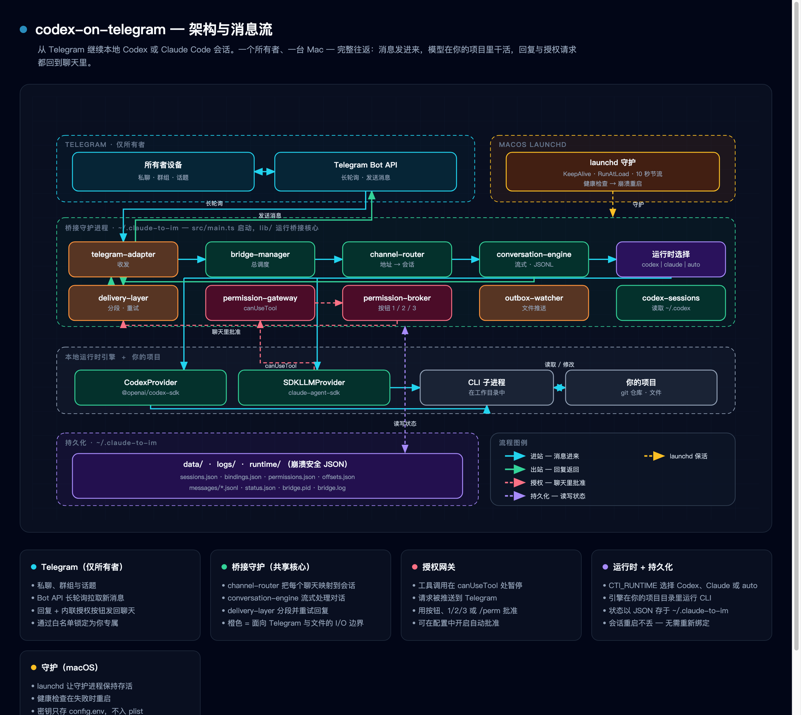

<div align="center">

# Codex on Telegram

**直接在 Telegram 里驱动本地的 Claude Code 与 OpenAI Codex 编程会话。**

[](./LICENSE)
[](https://nodejs.org/)


[English](./README.md) · **简体中文** · [日本語](./README.ja.md)

</div>

---

Codex on Telegram 是一个自托管的桥接服务，让你**从 Telegram 聊天中启动、绑定并续接本地的 AI 编程会话 —— 无论是 Claude Code 还是 OpenAI Codex**。你可以用手机随时开工，在外出途中回复权限请求，并在守护进程重启后续接完全相同的会话。它以一个轻量的 macOS daemon 形式运行，并且按设计只与 Telegram 通信。

<p align="center">
  
</p>

<p align="center"><sub>Telegram ⇄ 桥接守护进程（本仓库） ⇄ Claude Code / OpenAI Codex ⇄ 你的本地项目 · <a href="./docs/diagrams/architecture.zh.html">交互式 HTML</a></sub></p>

## ✨ 亮点

- **两套运行时，一个桥接。** 只需一项设置即可在 Claude Code 与 OpenAI Codex 之间切换（`CTI_RUNTIME` = `claude` | `codex` | `auto`）。Codex SDK 是一个*可选*依赖，因此即使没有它，桥接仍能正常安装和运行。
- **抗卡死的流监控。** 启动、流中和终端空闲三类计时器能检测到卡住的 Codex 流并中止它 —— 而不是把一个只完成一半的回答悄悄当作“已完成”交付出去。
- **感知工具、自我修复。** 长时间运行的工具调用不会误触发监控；流中出现的瞬时超时会在一个新线程上重试；中止一个卡死的回合会真正杀掉底层子进程，而不是任其泄漏。
- **崩溃安全的持久化。** 进行中的任务状态和待发送消息的引用会写入磁盘，因此守护进程重启后能续接同一个已绑定的会话。
- **按话题隔离的会话。** 私聊、群组以及启用了话题的群组各自保有独立的已绑定会话；owner 与 allowlist 锁让这个机器人只为你所用。
- **内置运维能力。** 一条命令即可控制守护进程（`start` / `stop` / `status` / `logs`）、一个 `doctor` 健康检查，以及一个 macOS 守护监督进程。

## 工作原理

Codex on Telegram 是一层轻薄的宿主封装，包裹着一个内置的、仅面向 Telegram 的桥接核心：

- **封装层**（`src/`）负责加入 Codex 运行时、磁盘持久化，以及可靠性层（watchdog、重试、中止处理）。
- **桥接核心**（`lib/`）—— 包括 Telegram 适配器、会话路由、投递 / 重试 / 去重、权限处理、输入校验、限流，以及 Markdown→Telegram 渲染 —— 来自 op7418 的 [`claude-to-im`](#致谢)，原样内置、未作改动。

## 环境要求

- **macOS**
- **Node.js ≥ 20**
- 一个 **Telegram bot token**（从 [@BotFather](https://t.me/BotFather) 获取）
- 至少一套运行时：**Claude Code CLI**，以及/或者用于 Codex 路径的 **`@openai/codex-sdk`**

## 快速开始

```bash
git clone https://github.com/leoshenzh/codex-on-telegram.git
cd codex-on-telegram
npm install
npm run build
```

创建你的配置文件（数据主目录为 `~/.claude-to-im/`）：

```bash
mkdir -p ~/.claude-to-im
cp config.env.example ~/.claude-to-im/config.env
```

编辑 `~/.claude-to-im/config.env`，至少设置以下各项：

```bash
CTI_RUNTIME=codex                       # claude | codex | auto
CTI_TG_BOT_TOKEN=123456:your-bot-token  # from @BotFather
CTI_TG_OWNER_USER_ID=100000001          # your Telegram user ID (owner lock)
CTI_TG_ALLOWED_USERS=100000001          # comma-separated allowlist
CTI_DEFAULT_WORKDIR=/path/to/your/project
```

若要在群组 / 话题中使用，还需设置 `CTI_TG_REQUIRE_PRIVATE_CHAT=false`，并在 @BotFather 中为你的机器人**关闭隐私模式（privacy mode）**，这样群组中的普通消息才能抵达桥接。

启动守护进程：

```bash
bash scripts/daemon.sh start
```

## 守护进程命令

| 命令 | 作用 |
| --- | --- |
| `bash scripts/daemon.sh start` | 启动桥接守护进程 |
| `bash scripts/daemon.sh stop` | 停止守护进程 |
| `bash scripts/daemon.sh status` | 显示运行状态 |
| `bash scripts/daemon.sh logs [N]` | 查看最近 *N* 行日志 |
| `bash scripts/doctor.sh` | 运行健康与配置诊断 |

## 配置

完整的字段列表见 [`config.env.example`](./config.env.example)。最常用的字段如下：

| 变量 | 说明 |
| --- | --- |
| `CTI_RUNTIME` | 后端运行时：`claude` / `codex` / `auto` |
| `CTI_DEFAULT_WORKDIR` | 新会话的默认工作目录 |
| `CTI_DEFAULT_MODE` | 默认模式：`code` / `plan` / `ask` |
| `CTI_DEFAULT_MODEL` | 可选的模型覆盖（不设置则沿用运行时的默认模型） |
| `CTI_TG_BOT_TOKEN` | Telegram bot token |
| `CTI_TG_OWNER_USER_ID` | 仅限 owner 的锁（你的 Telegram user ID） |
| `CTI_TG_ALLOWED_USERS` | 以逗号分隔的用户 / 聊天 allowlist |
| `CTI_TG_REQUIRE_PRIVATE_CHAT` | 设为 `false` 以允许群组 / 话题 |
| `CTI_AUTO_APPROVE` | 自动批准工具权限请求 |
| `CTI_CODEX_*` | Codex 运行时覆盖项（审批策略、沙箱模式、推理强度、网络访问等） |

## 同时跑两套运行时

单个守护进程在启动时只会绑定**一种**运行时，该进程上的所有会话共用它。想让 Codex 和 Claude 并行使用，就跑**两个守护进程**，一个运行时一个，彼此完全隔离。每个守护进程都需要：

- **独立的仓库克隆** —— macOS launchd 的服务标识是由仓库路径派生出来的，所以两个守护进程必须放在两个不同的目录里；
- **独立的数据目录**（通过 `CTI_HOME` 指定，各自的配置、会话、pid、日志）；
- **独立的 bot token** —— 你会和两个不同的机器人对话。

```bash
# 机器人 A —— Codex
git clone https://github.com/leoshenzh/codex-on-telegram.git cot-codex
cd cot-codex && npm install && npm run build
mkdir -p ~/.claude-to-im-codex
cp config.env.example ~/.claude-to-im-codex/config.env
# 编辑：CTI_RUNTIME=codex，CTI_TG_BOT_TOKEN=<机器人 A 的 token>，……
CTI_HOME=~/.claude-to-im-codex bash scripts/daemon.sh start

# 机器人 B —— Claude（独立克隆、独立数据目录、独立 token）
git clone https://github.com/leoshenzh/codex-on-telegram.git cot-claude
cd cot-claude && npm install && npm run build
mkdir -p ~/.claude-to-im-claude
cp config.env.example ~/.claude-to-im-claude/config.env
# 编辑：CTI_RUNTIME=claude，CTI_TG_BOT_TOKEN=<机器人 B 的 token>，……
CTI_HOME=~/.claude-to-im-claude bash scripts/daemon.sh start
```

现在两个机器人并行运行 —— 想用哪个运行时就给哪个发消息。对该克隆执行任何 `daemon.sh` 命令（`stop` / `status` / `logs`）时，都要带上同一个 `CTI_HOME=…`。

## 在 Telegram 中使用

- **直接发一条消息** —— 无论是在私聊、群组还是话题中：如果还没有任何绑定，会自动创建一个会话。
- **`/sessions`** —— 先列出当前会话，再列出近期的桥接会话，最后列出可发现的本地 Codex 会话。
- **`/bind <id|prefix>`** —— 通过完整 id 或唯一前缀，把一个 Telegram 窗口或话题绑定到指定会话（前缀有歧义时会被拒绝，而不是擅自猜测）。
- 在启用了话题的群组中，每个话题各自保有**独立的**会话。一次正常的守护进程重启会保留原有绑定 —— 无需重新绑定。

## 项目结构

```
src/        Host wrapper: Codex provider, store, local-session discovery, daemon entry
lib/        Vendored bridge core (op7418's claude-to-im)
scripts/    Daemon control, doctor, macOS supervisor, build
docs/       Design notes & fix plans
```

## 致谢

Codex on Telegram 是 **op7418 的 `claude-to-im`**（MIT）的衍生作品。[`lib/`](./lib) 下的 Telegram 桥接核心是 op7418 的成果，原样保留、未作改动；Codex 运行时、可靠性加固和持久化各层则是本项目新增的部分。所有原始版权声明均予以保留 —— 详见 [NOTICE](./NOTICE)、[LICENSE](./LICENSE) 和 [lib/LICENSE](./lib/LICENSE)。

## 许可证

[MIT](./LICENSE)。
